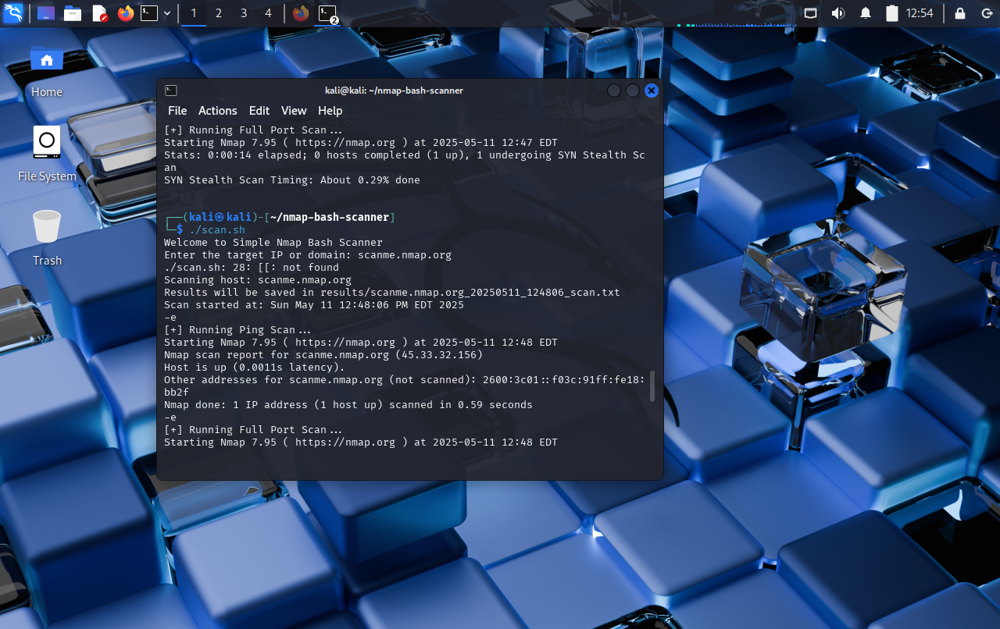

# Automated Network Reconnaissance using Nmap and Bash

## 🔍 Overview
This tool automates network scanning using Nmap and Bash for beginners in cybersecurity.

## 🚀 How It Works
1. Run `scan.sh`
2. Enter a target (IP/domain)
3. Results are saved in the `results/` folder with timestamps

## 💡 Features
- Ping scan
- Full port scan
- OS and service detection

## 📂 Example
```bash
$ ./scan.sh
Enter the target IP or domain: scanme.nmap.org
```

## 📸 Sample Scan Output

Here's an example of what the terminal output looks like:



